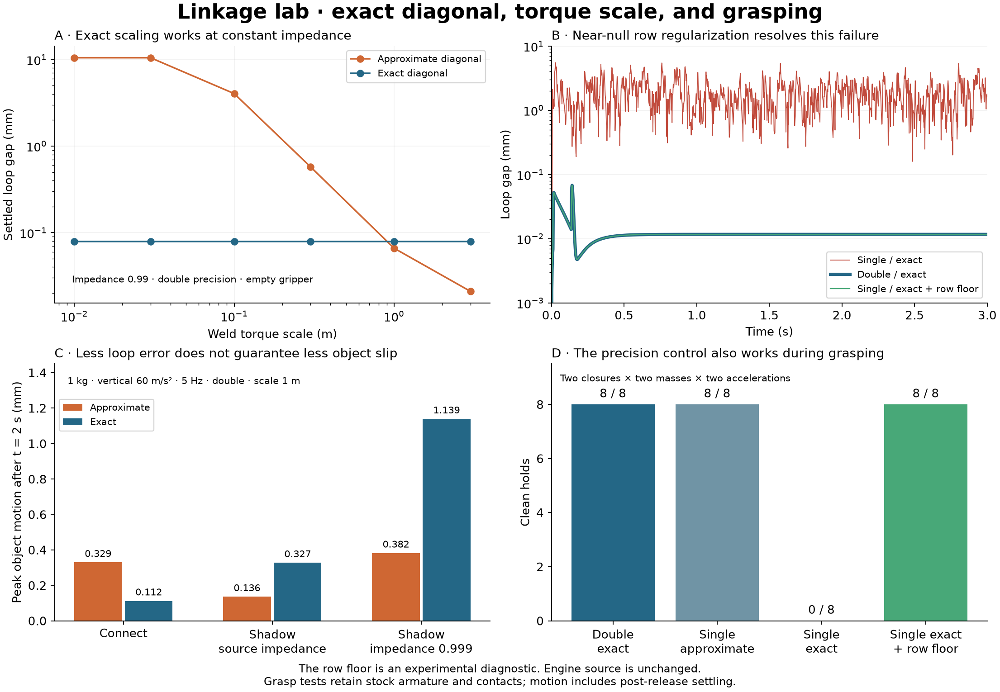
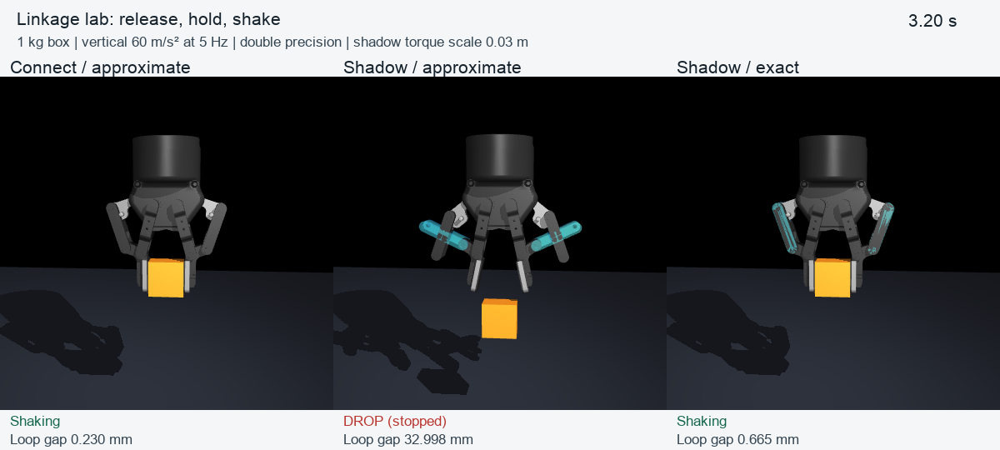

# Robotiq: exact diagonal, weld scaling, and real grasps

19 September 2026. Engine source is unchanged from the first experiment. This follow-up contains 72 numerical diagnostic runs and 220 grasp runs: a 24-run pilot, a 172-run main matrix, and 24 timestep checks. Repeated control cases are included in those counts.

The exact diagonal calculation is correct for the Jacobians and mass matrices supplied to it. The failure is a robustness problem when almost-null equality rows, containing floating-point noise, receive almost-zero regularization. A lab-only regularization floor resolves the observed single-precision failures without changing the meaningful double-precision results. Separately, `diagexact` gives the expected torque-scale invariance when weld impedance is constant.



[Grasp comparison movie](results/grasp/grasp-comparison.mp4): native simulation states replayed with the prescribed base translation reconstructed from acceleration. The middle panel stops when the object drops; the other two continue shaking. All three use double precision and the source equality parameters; both shadow models use torque scale 0.03 m.



## 1. What is wrong with the exact diagonal?

For each row, independently compute `A_ii = J_i M^-1 J_i^T` in NumPy from the native runner's exported Jacobian and full mass matrix. Compare with the native whitened-Jacobian squared norm *before* MuJoCo's impedance floor adjusts `efc_diagA`. This checks every nonzero row, including the nearly null ones. Maximum relative error is below 3e-16 in double and 1e-7 in single precision. This verifies the diagonal algebra conditional on the computed J and M; it does not claim that a roundoff-contaminated Jacobian represents the exact mechanism.

MuJoCo sets `R_i = max(mjMINVAL, (1-d)/d * A_ii)`. In this planar mechanism, some spatial closure rows should carry no independent information. Roundoff in their residuals and Jacobians matters because squaring a tiny Jacobian produces a much tinier diagonal. A residual of order epsilon with a diagonal of order epsilon squared can produce a multiplier of order 1/epsilon. Multiplication by the tiny Jacobian need not then make its generalized force negligible. An exactly zero Jacobian row produces no generalized force, even if its multiplier is enormous; neighboring nearly zero rows are the dangerous case.

The absolute `mjMINVAL` floor is enough to suppress this effect in the tested double-precision geometry, but not in single precision. The earlier rigid coordinate-rotation control and the controls below point to the same mechanism.

The diagnostic callback in `regularization.h` retains the exact diagonal on meaningful rows and applies

`R_i <- max(R_i, eta * max(R_block))`, with `eta = 1e-6`,

to each three-row translation or rotation block of connect/weld equalities. It updates the reciprocal weights and island copies consistently. It does not change J, residuals, contact weights, armature, or the engine source. Translation and rotation are separate blocks so their different units/scales are not mixed. The callback is deliberately restricted to dense-Jacobian Newton solves with `implicitfast`.

| Empty gripper, stationary base | Double exact: settled gap | Single exact, unmodified | Single exact + diagnostic floor |
|---|---:|---:|---:|
| Connect | 0.011707 mm | 1.979 mm mean, 7.18 mm peak | 0.011722 mm |
| Shadow, scale 1 m | 0.088149 mm | fails at about 0.624 s | 0.088150 mm |

Settled means the mean from 1.8 seconds to the end of the nine-second diagnostic run. The shadow failure time is specific to this native build and can vary with floating-point arithmetic. The floor changes the double-precision settled gaps by less than 1e-11 mm in these tests.

Additional controls:

- Relative floor 1e-12 partially improves the result; 1e-9, 1e-6, and 1e-3 all bring it close to the double result. This is a sensitivity check, not a calibrated universal threshold.
- Raising Newton's iteration limit to 1000 and setting tolerance to zero does not resolve the failure. Switching to CG with 1000 iterations also does not resolve it. This is not fixed by merely solving harder.
- Replacing each block's diagonal weights by their mean also removes the failure, but changes meaningful double-precision compliance. That is a different regularization model, not a neutral bug fix.
- The floor works with contact: both connect and stiff-shadow models recover their tested single-precision grasps. It acts only on equality rows, which helps localize the instability.

This is a demonstrated remedy for these reproductions, **not a proposed production threshold**. A general engine change needs a policy for almost-uncontrollable directions, including genuine near-singular mechanisms and large inertia ratios. A block-relative floor is the smallest change demonstrated here; an isotropic block policy is another design choice with different compliance. Sparse storage, other solvers/integrators, and broader mechanisms need engine-level coverage before adopting either.

Relevant source functions are `mj_makeYNumeric`, `mj_makeImpedance`, and `getposdim` in `src/engine/engine_core_constraint.c`. No changes to these functions are included.

## 2. Torque scale was a useful lead

Sweep weld `torquescale` over 0.01, 0.03, 0.1, 0.3, 1, and 3 m. Cross approximate/exact diagonal with the source position-dependent impedance and constant impedances 0.95, 0.99, and 0.999. Keep `solref="0.005 1"` fixed.

With constant impedance, scaling an angular row by s scales its residual and Jacobian by s and its exact inverse-inertia diagonal and regularizer by s squared. The row's contribution to the primal quadratic cost is unchanged. The experiment shows this cancellation:

| Constant impedance | Exact: settled gap for every scale |
|---|---:|
| 0.95 | 0.392697 mm |
| 0.99 | 0.079226 mm |
| 0.999 | 0.007938 mm |

For comparison, at impedance 0.99 the approximate-diagonal gap changes from about 10.503 mm at scale 0.01 m to 0.020956 mm at scale 3 m. The approximate weld angular weight does not track the squared torque scale.

With the source `solimp="0.95 0.99 0.001"`, torque scaling also changes the six-dimensional weld residual norm used to select impedance. Therefore exact diagonal scaling does **not** promise invariance in this case. It changes the impedance and stabilization response themselves. This explains the earlier exact-diagonal torque-scale dependence; it was not evidence of an incorrect exact diagonal.

The invariance also survives contact: the exact-diagonal shadow grasps at constant impedance 0.999 agree between torque scales 0.03 and 1 m, up to numerical differences. The corresponding approximate models can behave very differently.

## 3. The grasp-and-shake laboratory

Use the original Menagerie gripper from the first experiment. Turn it upside down so the fingers point downward. Insert a 40 × 24 × 40 mm box between the pads. Close with a smooth command ramp over 0.8 seconds, release a temporary weld fixture at 1.2 seconds, start shaking at 2 seconds, shake for four seconds with one-second ramps, and recover for one second. The box is a free rigid body after release. A decorative floor has no collision; it cannot rescue the grasp.

Prescribed translational acceleration acts through the accelerated-frame gravity on both gripper links and object. All actual contacts remain enabled. A 5 Hz sinusoid is applied vertically or sideways; box masses are 0.25 and 1 kg; peak accelerations are 0, 30, 60, and 100 m/s². The main comparison uses command 255. The pilot also checks 128, 160, and 200. The actuator reaches its original force limit of 5 in the relevant saturated holds; raising an already saturated command does not identify or increase physical grip force.

The five closure variants are connects, shadow/source-impedance at torque scales 0.03 and 1 m, and shadow/constant-0.999-impedance at scales 0.03 and 1 m. The global `diagexact` flag also changes contact regularization, so approximate-versus-exact grasp differences cannot all be attributed solely to loop closure. The diagnostic floor changes equality weights only.

Measurements include object translation/rotation, original joint-cut separation, both fingers' normal force, tangential force, penetration, non-pad object contacts, self contacts, actuator force, equality power, and full generalized position. The fixture status is recorded so supported closing cannot be confused with holding.

A run is labelled a **clean hold** only if it establishes bilateral pad force before shaking, completes without numerical failure or a drop, avoids other object contacts, stays within 5 mm object motion / 10 degrees rotation after t=2 s, and keeps loop separation below 1 mm. These are explicit laboratory screening thresholds, not hardware specifications. Raw metrics remain available. A drop stops a run at more than 50 mm downward displacement or 100 mm total displacement from the placement pose.

## 4. What the grasps show

For a 1 kg box, vertical 60 m/s² at 5 Hz, 2 ms timestep, double precision:

| Closure | Approximate: object motion / loop gap | Exact: object motion / loop gap |
|---|---:|---:|
| Connect | 0.329 / 0.276 mm | 0.112 / 0.245 mm |
| Shadow scale 1, source impedance | 0.136 / 0.845 mm | 0.327 / 0.499 mm |
| Shadow scale 1, impedance 0.999 | 0.382 / 0.228 mm | 1.139 / 0.107 mm |

All six satisfy the clean-hold criteria. Motion is relative to the average pose during 1.8–2 seconds and includes post-release settling, not just motion attributable to shaking. Corresponding no-shake controls are included; in some cases static creep is larger than the displacement during shaking. These numbers are not a hardware accuracy ranking.

The small-scale shadow with approximate diagonal is especially revealing: at source impedance it drops the object before the shake; raising impedance to 0.999 can keep an object between the pads while allowing tens of millimetres of linkage error. Calling that a good grasp would conceal a broken mechanism. Exact diagonal supports useful grasps at this smaller scale, consistent with its scaling advantage.

At 100 m/s², a 1 kg box often moves far enough to contact non-pad gripper geometry. Some runs are then caught again. In particular, connect/exact at 2 ms avoids the stop condition but moves roughly 38 mm and contacts other parts. At 1 and 0.5 ms it drops. The 60 m/s² clean grasps and their motion metrics remain close across 2, 1, and 0.5 ms; the high-acceleration “survival” is not a reliable result.

Eight precision-control cases use connect/stiff-shadow × 0.25/1 kg × 0/60 m/s² vertical acceleration:

| Configuration | Clean holds |
|---|---:|
| Double, exact | 8 / 8 |
| Single, approximate | 8 / 8 |
| Single, exact | 0 / 8 (four drops, four numerical failures) |
| Single, exact + equality row floor | 8 / 8 |

The floor-treated single runs closely follow double precision. Matching successful behavior here does not establish global robustness of the floor.

## Reproduce and inspect

From the repository root, with the same pinned Menagerie source and task-specific NumPy/Matplotlib environment as the first report:

```sh
python3 experiments/linkage_lab/build.py double
python3 experiments/linkage_lab/build.py single
python3 experiments/linkage_lab/investigate.py
python3 experiments/linkage_lab/grasp_sweep.py experiments/linkage_lab/source_assets/robotiq_2f85 --pilot
python3 experiments/linkage_lab/grasp_sweep.py experiments/linkage_lab/source_assets/robotiq_2f85
python3 experiments/linkage_lab/grasp_sweep.py experiments/linkage_lab/source_assets/robotiq_2f85 --convergence
python3 experiments/linkage_lab/phase2_plot.py
```

The numerical investigation uses the committed asset-free models, so it needs no Menagerie download. Its independent diagonal and cross-precision checks assert their tolerances. The plot can be regenerated from the committed summaries and packed traces without rerunning physics.

To reproduce one grasp with the diagnostic floor:

```sh
python3 experiments/linkage_lab/grasp.py experiments/linkage_lab/source_assets/robotiq_2f85 --closure shadow --impedance .999 --mass 1 --precision single --exact 1 --peak 60 --mode floor --name single-floor
```

Native runners select the experiment with `LINKAGE_REGULARIZATION=raw|floor|block` and optional `LINKAGE_FLOOR`; default is unmodified `raw`. The callback is a diagnostic intervention, not an engine option. Raw traces and generated meshes/models are ignored; compact result tables, numerical snapshots, plots and movie are included. New grasp metadata records model and native binary hashes.

`replay_grasp.py /path/to/ffmpeg` renders the movie from the main sweep's saved native states using Python MuJoCo only for visualization; it does not simulate them with the Python package. It requires Pillow, NumPy, a rendering-capable MuJoCo Python installation and ffmpeg. The native C++ runners determine all reported physics.

The next modeling comparison should match endpoint compliance and grip force before comparing topology, then test other box widths, asymmetric placement, rotations and held-out motions. We have a useful grasp test now; numerical tuning still does not identify real hardware parameters.
