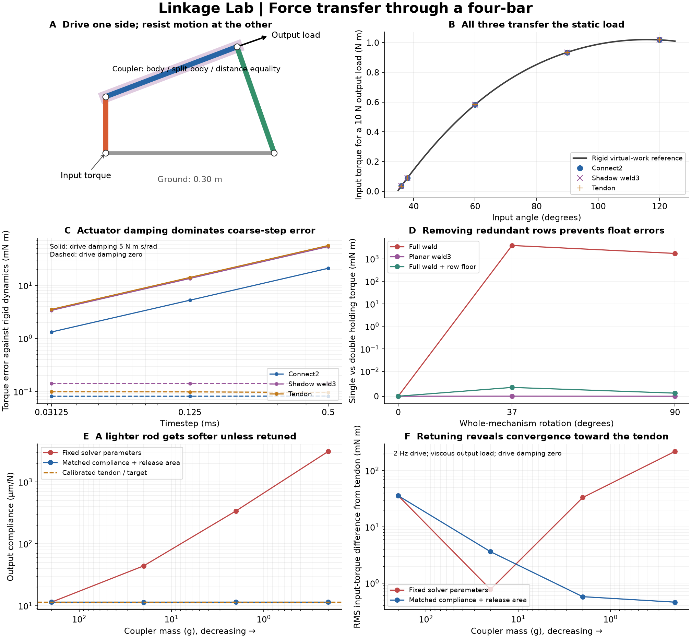
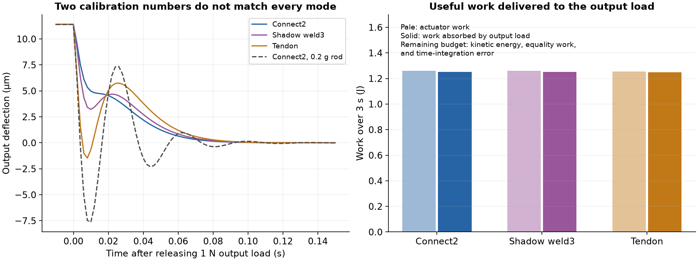

# Four-bar force transfer: connect, shadow weld, and tendon

19 September 2026. **Both tuned connect and tuned shadow weld transfer force accurately in this mechanism. There is no demonstrated weld advantage.** A planar closure removes the observed redundant-row precision problem. A bilateral tendon-distance equality transfers tension and compression correctly when the coupler's mass and collision geometry can be omitted. The most consequential dynamic error in the first driven comparison came from implicit actuator damping at finite timestep.

This study contains 324 native simulation runs (including calibration evaluations and repeated controls), 30 geometry/inertia/rank audits, and three transmission-toggle rank checks. Both double and single precision use this task's engine builds; engine code is unchanged. All runs completed without the runner's warning/divergence flags. Two full-weld single-precision cases nevertheless had large force errors: completion is not an accuracy criterion.



## Mechanism and physical reference

The input crank, coupler, output rocker, and ground are 0.10, 0.25, 0.20, and 0.30 m long. The moving masses are 0.30, 0.20, and 0.40 kg. Their inertias are those of uniform cylinders of radius 6 mm. Gravity, contacts, joint damping, and armature are absent. The positive circle-intersection branch fixes the assembly configuration.

- **Connect:** one massive coupler, cut at its distal hinge; ordinary connect has three rows, the planar prototype two.
- **Shadow weld:** two coincident half-mass couplers, one in each tree branch, welded at their centers with torque scale 0.1 m. Each copy has half the complete inertial tensor. Ordinary weld has six rows, the planar prototype three.
- **Tendon:** remove the coupler and impose a bilateral constant-distance equality between its former endpoints. This is an equality reaction of either sign, not a unilateral cable-length limit. There is no coupler mass or collision geometry.

Let input and output angles be theta and phi, and `r = C - B` the coupler vector. Differentiating its fixed length gives

`phi'(theta) = (r · B'(theta)) / (r · C_phi(phi))`.

Virtual work predicts the static actuator torque `tau_in = -tau_out phi'`. An output force tangent to the rocker has `tau_out = -0.20 F`. For dynamics the independent one-coordinate rigid reference is

`tau_in = H(theta) theta_ddot + 0.5 H'(theta) theta_dot² - tau_out phi'`,

where H sums each body's translational and rotational kinetic-energy coefficients. The comparison uses measured input angle, velocity, and continuous-time acceleration, rather than assuming that the position servo tracks perfectly. H' is evaluated by a centered difference of the analytic H with a 1e-5 rad increment.

The audited tangent obeys `J v = 0`, and its native `vᵀ M v` matches H in both precisions. Connect and shadow weld give the same H: **0.004007764292 kg m² at 90 degrees**. The massless tendon gives **0.002169693549 kg m²**. Removing this particular 200 g coupler removes about 46% of the effective input inertia, despite leaving static transmission unchanged.

## Physical calibration, then force transfer

At a nominal input angle of 90 degrees, apply a 1 N output load from 0.25 to 1.25 s, then release it. Endpoint deflection is the output arc displacement relative to the rigid geometry at the **actual** input angle; this excludes input-servo compliance. Calibrate two measurements:

1. Settled output deflection per unit load: **11.3982 micrometers/N**.
2. Absolute deflection area following release, divided by the initial deflection: **19.7500 ms**.

The second is a measured release-area time, not an identified modal time constant. Matching these two numbers does not match every transient mode. The calibration uses a 0.5 ms timestep, exact diagonal, planar rows, and input servo `kp=500`, `kv=5`.

| Closure / coupler mass | Constant impedance | solref time constant (s) | Damping ratio |
|---|---:|---:|---:|
| Connect2 / 200 g | 0.99000000 | 0.01000000 | 1 |
| Shadow weld3 / 200 g | 0.98909981 | 0.00999991 | 1 |
| Tendon / zero | 0.99219302 | 0.00948847 | 1 |
| Connect2 / 20 g | 0.99741495 | 0.00999996 | 1 |
| Connect2 / 2 g | 0.99963372 | 0.00953819 | 1 |
| Connect2 / 0.2 g | 0.99989999 | 0.01852909 | 0.31651249 |

All final calibrations match compliance within 0.03% and release-area time within 0.07%. At 0.2 g, fitting only impedance and time constant with damping ratio fixed at one hits the impedance bound. Allowing damping ratio to vary obtains the match, but introduces visibly different ringing.



**Static transmission:** test output forces -10, -1, +1, +10 N at input angles 36, 38, 60, 90, and 120 degrees. All three formulations reproduce virtual-work holding torque, with a maximum absolute discrepancy of **0.411 mN m** across the 60 cases. At 90 degrees and 10 N, connect and weld both require about **0.93454 N m**, with about **114 micrometers** output deflection. Calibration at one posture does not make compliance identical elsewhere: at 36 degrees the three deflections are approximately 166, 131, and 53 micrometers respectively.

The transmission toggle is at **34.771944 degrees**, where `phi'=0`. The ideal output force per input torque diverges there. Direct rank checks show that connect2, weld3, and tendon still have full row rank and one allowed mechanism velocity at this posture. A zero transmission ratio is therefore distinct from redundant constraint rows or a loss of closure rank. The loaded sweep approaches the toggle; it does not claim arbitrary-load robustness exactly at it.

## Driven transmission exposes an integration effect

The input target oscillates by 10 degrees, with a smooth one-second onset. The output opposes motion with `tau_out = -1 N m s/rad * phi_dot`, so it continuously absorbs useful work. Test 0.5, 2, and 5 Hz, with timestep refinement. The simulation lasts three seconds; torque RMS errors use the last two seconds. Work covers the entire three seconds.

With input actuator damping `kv=5`, torque errors are approximately proportional to timestep. Additional controls vary that damping independently, retaining the same output load. At 2 Hz and a 0.5 ms timestep:

| Closure | Torque RMS error, kv=5 (mN m) | Torque RMS error, kv=0 (mN m) | Output deflection RMS, kv=0 (micrometers) |
|---|---:|---:|---:|
| Connect2 | 20.971 | 0.082 | 40.67 |
| Shadow weld3 | 53.871 | 0.142 | 40.83 |
| Tendon | 56.427 | 0.096 | 41.87 |

The reference torque RMS is about 0.34 N m. With actuator damping removed, all three errors are below 0.05% of this reference. This is a loaded test, not free motion: the output damper remains active and absorbs about **1.25 J** in each case. Connect and weld deliver 1.25076 and 1.25118 J respectively.

The source of this sensitivity is consistent with `mj_implicit`: constraints are solved first using M, then the velocity update uses the smooth-force derivative in `M - h D`. Implicit actuator damping changes that update without a new closure solve. Lowering h or actuator damping sharply reduces the discrepancy. The damping sweep and refinement isolate the effect; this study does not modify that integration scheme or prove that it is the only source of error in arbitrary mechanisms. Output damping here is an externally applied torque sampled each step, so it is not included in the implicit derivative.

At 0.03125 ms with kv=5, the errors fall to 1.323, 3.383, and 3.532 mN m. With kv=0 they are approximately 0.081, 0.142, and 0.099 mN m. Thus the remaining small errors have a different limit, consistent with finite compliance. **A coarse-step ranking of closure methods can largely be a ranking of their interaction with the actuator and integrator.** Reducing actuator damping is a diagnostic here, not a universal controller recommendation.

## Redundant rows, precision, and coordinate dependence

The lab-only callback in `planar_rows.h` expresses the translational residual and Jacobian in the fixed mechanism plane, retains its two in-plane components, and for weld retains the angular component about the plane normal. It projects velocity and reference acceleration consistently, compacts the rows, and recomputes the exact diagonal for the projected Jacobian. The hinge tree already enforces planarity.

At a world-aligned plane in double precision, full and planar driven trajectories agree within the exported precision: maximum recorded input-angle difference is zero and input-torque difference is about 1e-12 N m. This is checked separately for connect and weld. It validates these laboratory prototypes, not a general row-removal API. They require one equality, dense Newton, implicitfast, no contacts, and disabled islands. They still build the full constraints before compacting them, so their runtime does not establish the speed of a native connect2/weld3 implementation.

The 84 force-bearing precision controls cover both precisions, approximate/exact diagonal, three whole-mechanism rotations, full/planar rows, and the previous relative-row-floor diagnostic. In single precision the **full exact-diagonal weld** has large holding-force errors at 37 and 90 degrees. Planar weld3 and the full weld with the relative floor prevent those large errors. The connect and tendon cases do not reproduce the same large errors in this particular geometry. Do not generalize that to Robotiq, whose connect failure was reproduced separately.

There are two distinct effects:

- **Roundoff amplification:** an almost-zero row with a tiny regularizer can produce a large spurious generalized force. Removing that row or applying the diagnostic relative floor prevents the observed failures.
- **Soft-model coordinate dependence:** at 37 degrees, even double-precision full connect/weld deflect about 105 micrometers under 10 N, versus about 114 micrometers for their planar counterparts. Nonzero redundant rows redistribute the diagonal regularization. The row floor does not remove this difference. At finite softness, equivalent hard-constraint row spaces need not define equivalent soft constraints.

The allowed mechanism motion is `ker(J)`. Redundant constraint reactions lie in `ker(Jᵀ)`. The former is necessary; the latter is relevant to this diagnostic. A planar closure avoids the extra spatial rows, but does not by itself make every choice of constraint coordinates or regularization physically equivalent.

## Tendon elimination and energy

Decrease the coupler mass through 200, 20, 2, and 0.2 g. With unchanged solver settings, compliance rises from **11.4 to 3,120 micrometers/N**. That is not a valid numerical approximation to the same stiff massless rod. After physical calibration, driven behavior instead approaches the calibrated tendon:

| Coupler mass | RMS input-torque difference from tendon, fixed settings (mN m) | After calibration (mN m) |
|---|---:|---:|
| 200 g | 35.741 | 35.741 |
| 20 g | 0.771 | 3.621 |
| 2 g | 33.190 | 0.574 |
| 0.2 g | 219.226 | 0.458 |

These comparisons use the same 2 Hz target, output damper, zero input actuator damping, and 0.5 ms timestep. The deceptively good fixed-parameter result at 20 g is not a convergent trend. In the calibrated series the final error is about 0.13% of the tendon reference torque RMS. Residual differences do not vanish over this finite series: posture-dependent compliance and transient modes remain different. This is evidence of approach to the tendon response, not proof of an exact soft-model limit.

For an ideal stationary holonomic constraint, equality power is `lambdaᵀ J v = 0`, independent of closure representation. With soft constraints it need not vanish and does not generally correspond to a stored conservative potential. We record actual generalized equality power, actuator work, output work, kinetic-energy change, and the residual in their balance. Here gravity and other passive forces are absent, making that budget interpretable. MuJoCo's reported mechanical energy is not augmented with an assumed equality spring energy.

In the passive one-second control, initialize exactly tangent velocity at 1 rad/s input speed and disable the drive. At a 0.25 ms timestep, relative kinetic-energy changes are approximately -0.0035% (connect), -0.0009% (weld), and -0.0009% (tendon). These small passive drifts do not establish energy-conservation superiority: the tendon has different physical inertia, and equality work plus integration error must both be considered. In the driven kv=0 cases, measured equality work is about -1.1 to -1.3 mJ out of about 1.25 J transferred. Work-budget residuals are about 0.5 to 0.9 mJ at 0.5 ms, and decrease with refinement.

## Reproduce and use the result

No external model assets are needed. From the repository root, using an isolated Python environment with NumPy 2+ and Matplotlib:

```sh
python3 experiments/linkage_lab/build.py double
python3 experiments/linkage_lab/build.py single
python3 experiments/linkage_lab/fourbar_sweep.py
python3 experiments/linkage_lab/fourbar_plot.py
```

The compact measurements, calibration histories, binary/library hashes, and audits are in `results/fourbar.json`; tabular run summaries are in `results/fourbar.csv`. Plots regenerate from committed results alone. Selected traces are sampled every 2 ms; all metrics were calculated at the simulation timestep. Raw traces and generated sweep models are excluded from version control.

The calibrated, asset-free XMLs are `repro/fourbar_connect.xml`, `repro/fourbar_weld.xml`, and `repro/fourbar_tendon.xml`. XML alone supplies full native equalities; planar reduction is selected by the lab runner. Its arguments are:

```text
fourbar_runner model.xml --audit rows exact
fourbar_runner model.xml output.csv mode rows exact dt load duration frequency [drive_kv]
```

`rows=0` uses native full rows, `1` the planar prototype, and `2` the relative-floor control. `exact` is 0/1. Modes are `static`, `calibrate`, `dynamic`, and `passive`. Static/calibration load units are N tangent to the rocker; dynamic load is output damping in N m s/rad. In passive mode load is ignored. Default input damping is 5 N m s/rad. Frequency is in Hz and dt/duration in seconds. The runner performs a forward evaluation before each recorded sample, then steps; the timing field covers only the step and is not a controlled performance benchmark.

For example:

```sh
mkdir -p experiments/linkage_lab/raw
build-linkage-double/fourbar_runner experiments/linkage_lab/repro/fourbar_weld.xml experiments/linkage_lab/raw/weld-force.csv dynamic 1 1 .0005 1 3 2 0
```

The next Robotiq comparison should carry over the two main controls: **physical stiffness/transient calibration and actuator-damping/timestep refinement**, then compare grasps across orientations and held-out loads. The planar prototype needs a proper contact-aware implementation before use in that experiment. A contact-capable full weld with the diagnostic floor is a separate existing control. Nothing here shows that changing closure representation fixes collision geometry, friction, inertial-data errors, or hardware identification.

Background: MuJoCo's [equality-constraint formulation](https://mujoco.readthedocs.io/en/latest/computation/index.html#equality) and [solver-parameter definitions](https://mujoco.readthedocs.io/en/latest/modeling.html#solver-parameters). The quantitative findings above come from the committed local experiment, not those documentation pages.
