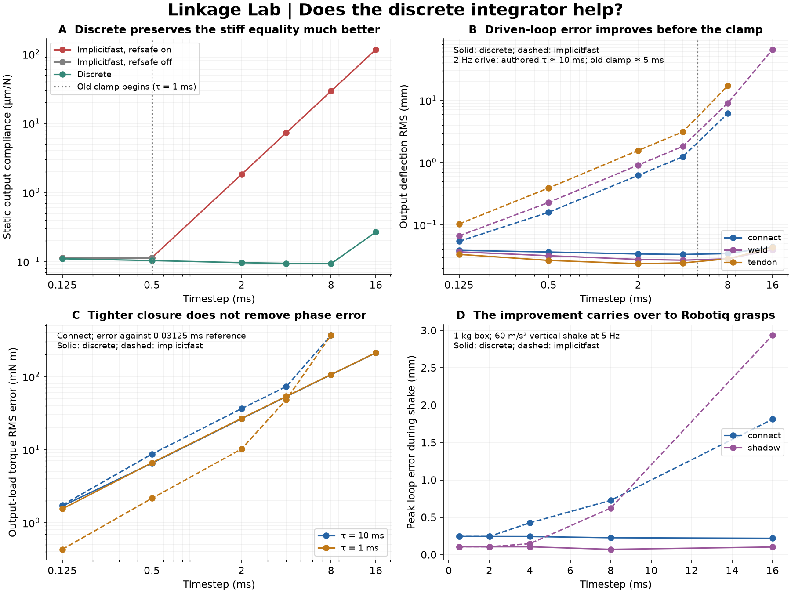

# Discrete integration under linkage loads

19 September 2026. **The earlier experiments used `implicitfast`. Switching to `discrete` substantially improves coarse-step loop closure and Robotiq grasp robustness.** The benefit is not restricted to the old reference-safety clamp: incorporating actuator stiffness and damping in the constraint solve also reduces the driven-loop error below that threshold. Smaller loop error does not guarantee smaller trajectory or transmitted-load error at every timestep.

This follow-up runs **282 four-bar cases and 80 actual Robotiq grasps**, with unchanged engine source. It extends the previous runner to allow native `discrete` integration, explicitly rejecting its incompatible laboratory row callbacks. All four-bar comparisons use native full constraints in a world-aligned plane. No planar reduction or diagnostic regularization floor is applied.



## What differs in this engine

For `implicitfast`, positive-format equality `solref` uses `timeconst >= 2h` when `refsafe` is enabled. The new integrator leaves equality spring and damping parameters authored, treats their response implicitly, and caps the effective impedance through the existing regularization floor. **It still has a separate `refsafe` rule for contacts and limits** to avoid unresolved spring restitution. Thus “no refsafe clamp” is correct for these linkage equalities, not for every constraint in a grasp.

`Discrete` also solves constraints in the same effective inertia used to advance velocity, including stabilizing actuator damping and stiffness. In this checkout, `mj_implicit` instead applies the smooth-force velocity update after the continuous-time constraint solve. This is the interaction identified in the previous experiment.

The data contract matters: under `discrete`, `qacc` is the velocity step divided by h, not continuous-time acceleration. This comparison therefore does **not** reuse the previous continuous-time inverse-dynamics torque-error metric. It compares trajectories and output-load torque against fine-step native trajectories. The measured double-precision step-map identity agrees within 1.6e-7 rad/s² after CSV rounding.

Relevant implementation: `getsolparam`, `mj_makeImpedance`, and `mj_regularizeConstraint` in `src/engine/engine_core_constraint.c`; the actuation-stage metric update and `mj_discrete` in `src/engine/engine_forward.c`; the discrete-integrator section in `doc/computation/index.rst`.

## Four-bar: isolate the clamp and the integration effect

Use the previous physically calibrated connect, shadow weld, and massless tendon parameters, with input `kp=500`, `kv=5`. Compare:

- `implicitfast`, ordinary `refsafe`;
- `implicitfast`, `refsafe` disabled;
- `discrete`, ordinary `refsafe`.

Run nominal time constants near 10 ms, then divide them by ten for a stiffer family. Do not retune between integrators. The main timesteps are 0.125, 0.5, 2, 4, 8, and 16 ms. Static tests hold a 10 N tangential output load; dynamic tests drive the input by 10 degrees at 2 Hz against the same 1 N m s/rad output damper as before. A smooth one-second onset precedes the measured response.

For the 1 ms connect equality, the static compliance is **0.114 micrometers/N** at a resolved timestep. With `implicitfast`, the clamp raises it to **29.20 at 8 ms** and **116.71 at 16 ms**. Those are the expected factors of 256 and 1024 from the squared effective time constant. With `discrete`, the corresponding values are **0.0933 and 0.2681 micrometers/N**. Disabling `refsafe` on `implicitfast` does not provide a robust substitute: this stiff connect fails the runner's numerical/divergence criterion at 2 ms and above.

Discrete compliance is not perfectly timestep invariant. Its regularization uses the timestep-dependent effective metric, and at sufficiently stiff/coarse settings the impedance ceiling intervenes. For the 10 ms connect, compliance changes from about 11.4 to 9.3 micrometers/N as h grows; the larger increase in the stiff 16 ms case is consistent with the row-weight ceiling. Identical authored parameters are therefore not a newly matched physical-compliance comparison across integrators.

The dynamic effect appears **before** clamping. At 0.5 ms with the approximately 10 ms equalities, output deflection RMS is:

| Closure | Implicitfast (mm) | Discrete (mm) |
|---|---:|---:|
| Connect | 0.1592 | 0.0366 |
| Shadow weld | 0.2289 | 0.0320 |
| Tendon | 0.3915 | 0.0269 |

The old clamp is inactive here. The difference is consistent with solving actuator feedback and closure together; the moderate change in static compliance is also present and should not be confused with a perfectly matched soft model.

At 8 ms, the same dynamic deflections become **6.16 vs 0.0346 mm** for connect and **9.06 vs 0.0285 mm** for weld. Output work over three seconds is approximately **0.382 vs 1.184 J** for connect and **0.240 vs 1.185 J** for weld, against fine-step values near 1.217 J. At 16 ms, discrete still completes for all three closures. Connect and tendon under implicitfast trigger the divergence criterion; the weld completes with roughly 66 mm output deflection, which is plainly inaccurate despite not triggering that criterion.

### Accuracy is more than closure

The fine reference uses `implicitfast` at 0.03125 ms. Both integrators also run at 0.0625 ms to assess refinement. Output-load torque is the prescribed viscous load, so its error measures velocity error directly. RMS comparisons use times from 1 to 3 s; deflection summaries use 1.5 s to the final sample. Rounding to whole steps ends the 16 ms runs at 3.008 s; accuracy comparisons exclude samples beyond the reference. Output work covers the actual run duration and uses the held output torque times actual angular displacement per step.

For the 10 ms connect at 0.5 ms, output-load RMS error drops from **8.69 to 6.52 mN m** with discrete. For the stiffer 1 ms connect at the same step it instead rises from **2.15 to 6.60 mN m**, even though discrete has tighter closure. At 2 ms those stiff-case errors are **10.21 vs 26.80 mN m**. The implicit position treatment and finite-step control/load sampling alter the motion response; increasingly rigid closure does not remove this phase/trajectory error.

At 16 ms the discrete output-angle RMS error is about **11 mrad**, and output-load torque error about **0.21 N m**. For the stiff connect, a fitted 2 Hz output harmonic lags the reference by **11.37 degrees**, with amplitude 1.35% lower; at 2 ms the lag is 1.43 degrees. This is much more useful than a diverged or badly deformed mechanism, but is not fine-step accuracy. The 0.0625 vs 0.03125 ms implicitfast reference differences in output torque are about 0.58–1.50 mN m for the softer family and 0.14 mN m for the stiff family. Comparisons approaching those magnitudes should not be overinterpreted.

The output damper remains an externally applied torque sampled and held each step; it is not an implicit joint damper. This retains the previous experiment's load exactly, but limits what the coarse-step result says about a fully implicit model of a physical damper. Recorded `requested_torque_error_Nm` compares the actuator force request at the sampled state, not its implicitly corrected end-of-step force. We do not make a continuous-time energy-conservation claim from those requests or from discrete `qacc`.

Across the 282 cases, 44 trigger the existing warning/divergence criterion: 32 unclamped implicitfast and 12 ordinary implicitfast, including repeated precision controls. None of the discrete cases do. The additional single/double and approximate/exact-diagonal controls at 0.5 and 8 ms reproduce the qualitative benefit. They use a world-aligned plane and do not establish that discrete cures the rotated near-null-row precision failures from earlier phases.

## Actual Robotiq grasps

Reuse the previous original connect and stiff shadow models: shadow torque scale 1 m, impedance 0.999. Grip the same 1 kg box with command 255, release its temporary fixture, then either hold quietly or shake vertically at 60 m/s² and 5 Hz. Test both diagonals and timesteps 0.5, 2, 4, 8, and 16 ms, in double precision. Contacts remain enabled, with each integrator's ordinary `refsafe` behavior.

At **16 ms**, for the shaken cases with the exact diagonal:

| Closure / integrator | Peak loop error (mm) | Peak object motion (mm) | Outcome |
|---|---:|---:|---|
| Connect / implicitfast | 1.812 | 0.868 | Large loop error |
| Connect / discrete | 0.220 | 0.311 | Clean hold |
| Stiff shadow / implicitfast | 2.937 | 0.778 | Large loop error |
| Stiff shadow / discrete | 0.104 | 0.322 | Clean hold |

All **40 discrete grasps** meet the existing clean-hold criteria. Of 40 implicitfast cases, **32 are clean holds and eight have excessive loop error**; all eight are at 16 ms. Neither integrator drops the object in this matrix. This is an improvement in retained shape and grasp motion, not a claim that all implicitfast grasps failed to hold.

At 0.5 ms the exact-diagonal shaken loop errors are nearly unchanged by the switch: about 0.245 mm for connect and 0.107 mm for shadow. At 16 ms discrete largely retains that quality. Object motion is not monotonic with timestep, and some coarse discrete runs are quieter than fine ones. Numerical damping and contact changes can help a hold without proving more accurate hardware behavior.

These are equal-parameter integrator comparisons within each gripper variant. Connect and shadow still have not been matched to the same physical gripper compliance. The abstract results continue to provide no general reason to prefer a weld over a connect. **Discrete is the useful new baseline to include in the next Robotiq force-transfer and grasp comparisons**, retaining fine-step controls and the separate precision diagnostics.

## Reproduce

The engine is unchanged; only the four-bar runner's allowed-integrator guard changes. Its row modes 1 and 2 remain limited to implicitfast because those callbacks operate before discrete regularization and reference assembly.

```sh
python3 experiments/linkage_lab/build.py double
python3 experiments/linkage_lab/build.py single
python3 experiments/linkage_lab/discrete_sweep.py --robotiq-source experiments/linkage_lab/source_assets/robotiq_2f85
python3 experiments/linkage_lab/discrete_plot.py
```

Use the pinned Menagerie revision and asset setup documented in the lab README. Without `--robotiq-source`, the script reuses the previous phase's generated grasp models when present, otherwise generates them from the default `source_assets/robotiq_2f85` location. The committed `results/discrete.json` contains all compact measurements and runner/library fingerprints. Raw traces and generated models remain task-local. The plot regenerates from committed results alone. No runtime speed comparison is claimed.
