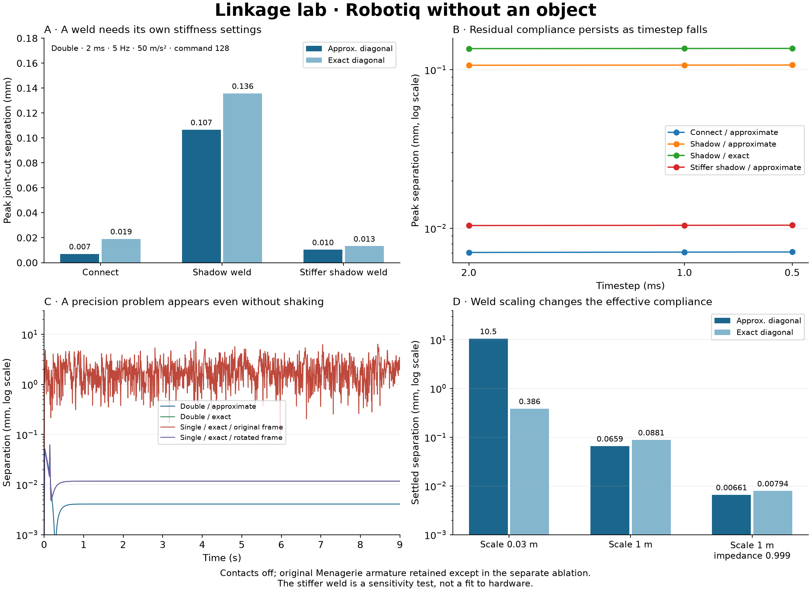

# Linkage lab

**Follow-up:** [Exact-diagonal investigation and actual grasp tests](PHASE2.md) explains the precision failure, isolates torque scaling, and adds 220 grasp runs with a comparison movie.

First experiment, 19 September 2026: the original Menagerie Robotiq 2F-85, without an object, under prescribed translational base acceleration. Compare joint-cut connects and body-cut shadow welds, independently switching the approximate/exact constraint-inertia diagonal.

**Result:** the shadow conversion preserves the intended rigid mechanism, but is not a drop-in numerical improvement in this experiment. Its soft compliance depends strongly on weld scaling and impedance. A separate single-precision problem with `diagexact` appears even at a stationary base and changes dramatically under a rigid coordinate rotation. No engine fix is included here.



## What was compared

Engine: MuJoCo [0452d71b0d6171551e2f0b06a87df925244f37d4](https://github.com/google-deepmind/mujoco/commit/0452d71b0d6171551e2f0b06a87df925244f37d4), native double and `mjUSESINGLE` builds. Model: Menagerie [8161bba264d7fa7c99ca301e91e7fb44737676ad](https://github.com/google-deepmind/mujoco_menagerie/tree/8161bba264d7fa7c99ca301e91e7fb44737676ad/robotiq_2f85), **original `robotiq_2f85`, not `robotiq_2f85_v4`**. `generate.py` checks the source XML digest. Mesh files come from that pinned checkout.

For each finger, split the leaf coupler into two coincident copies, halve its explicit mass and principal inertia on both copies, restore the cut physical hinge between the follower and the shadow, and weld corresponding frames at the coupler COM. The shadow is translucent blue. Keep collision surfaces on the original copy; do not duplicate children, armature, damping, or actuation. Add exclusions for the shadow and cross-branch adjacent bodies. The original driver coupling, actuator, springs, limits, and armature remain.

The compiled initial-state audit checks total mass, first moment, inertia, equality residuals, collision-geom count, constraint rank, and kinetic energy restricted to admissible velocities. The connect model has 8 velocities and equality rank 5; the shadow has 10 and rank 7. Both retain mobility 3. These are initial-configuration checks, not a proof that their soft trajectories agree.

All measured comparisons disable contact, use `implicitfast`, a dense Jacobian, 100 solver iterations maximum and tolerance `1e-10`. The existing armature is retained except in the separately labelled ablation. The source equality settings are `solref="0.005 1"`, `solimp="0.95 0.99 0.001"`. The stiffer-shadow variant changes only weld impedance to `0.999 0.999 0.001`; it is a sensitivity test, not a hardware fit or a matched-compliance calibration.

## Motion and measurements

Apply a constant actuator command, settle for 2 seconds, shake for 6 seconds, recover for 1 second. Acceleration is a 5 Hz sinusoid with a one-second quintic smooth ramp at each end. With `S(x) = 10x³ - 15x⁴ + 6x⁵` for x clamped to [0,1], the shake is

`a(t) = a_peak S(t-2) S(8-t) sin(2 pi 5 (t-2))`.

For a purely translating base, setting `gravity = gravity_world - acceleration` gives the exact inertial forcing in base-relative coordinates. There is no rotating frame, arm controller, object, or friction in this test. The full-amplitude sinusoid at 50 m/s² corresponds to a harmonic displacement amplitude of about 51 mm; the ramped acceleration need not integrate to a closed position trajectory.

The common physical error is separation of the two material points at each **original joint cut**, taking the worse finger. This remains the measurement in the shadow model; raw weld and connect residual norms would not be comparable. The CSV also records weld translation/angle, pad positions and aperture, equality power, energy terms, actuator force, contact count, iterations, and joint positions. Summaries use t=3–7 seconds for shaking, 1.8–2 seconds for settled values, and 8.8–9 seconds for recovery.

The full matrix contains 312 runs, including repeated controls between groups: commands 0/128/255 where indicated, peaks 0/10/50 m/s², selected x/y/z axes, timesteps 2/1/0.5 ms, two precisions, two closures and two diagonal settings. `experiment.py` defines the exact groups. All 312 compact summaries are saved. Full-rate traces remain local in ignored `raw/`; the four traces used in the figure are included in `results/plot-traces.npz`.

## Findings

For command 128, x acceleration 50 m/s² at 5 Hz, double precision, 2 ms:

| Closure | Approximate diagonal: peak separation | Exact diagonal: peak separation |
|---|---:|---:|
| Original connects | 0.0071 mm | 0.0191 mm |
| Shadow, torquescale 1 m | 0.1067 mm | 0.1358 mm |
| Shadow, torquescale 1 m, impedance 0.999 | 0.0104 mm | 0.0133 mm |

Reducing the timestep to 0.5 ms barely changes these errors. This is evidence that residual compliance, rather than time discretization, dominates this particular metric. It does not establish equivalent transient responses. Equal `solref`/`solimp` values across different closure formulations do not give matched endpoint compliance.

A 0.03 m weld torque scale initially looked appropriate for the part size but produced about 10.5 mm settled joint-cut error with the approximate diagonal, versus 0.386 mm with the exact diagonal. At scale 1 m these become about 0.066 and 0.088 mm. Angular scaling is consequential and the exact diagonal does not make all softness settings representation-independent.

The existing armature stabilizes the original model in this experiment. Removing passive follower/spring-link/coupler armature increases error, but does not reproduce the historical double-precision instability under this translational protocol. Driver armature is retained in this ablation.

### Single precision and redundant rows

With `diagexact` enabled, the original-frame connect model develops millimetre-scale separation even without shaking; the shadow model can fail before settling. The approximate-diagonal controls remain close to double precision. Six runs in the original 312-run matrix hit the explicit failure conditions. Other runs have large, unacceptable errors without triggering those conditions: `failed=false` means the run completed, not that it was accurate.

Rotating the whole moving gripper 90 degrees about vertical and rotating the shake axis from x to y brings both single-precision formulations close to double precision. Gravity and the physical experiment are unchanged. This is an orientation-sensitivity diagnostic, not a robust modeling remedy.

The saved initial row diagnostics show nearly zero Jacobian rows receiving tiny regularizers and enormous multipliers in single precision. In particular, an exactly zero row can have a small nonzero position residual and a huge force multiplier; that row alone produces no generalized force, while neighboring nearly zero rows can. The likely mechanism is roundoff in redundant constraints amplified by the regularization scaling. This is evidence for a targeted engine investigation, not yet a proven complete diagnosis.

`repro/connect_exact.xml` and `repro/shadow_exact.xml` require no mesh assets. Their inferred inertias have been made explicit; removing meshes preserves the initial double-precision mass matrix exactly. The native single-precision runner reproduces the problem with command 128 and no shaking. Failure time can vary with floating-point arithmetic. The rotation control is independently regenerated by `generate.py --aligned-base`.

## Reproduce

Requirements: CMake, Ninja, a C++17 compiler, Python with NumPy 2+ and Matplotlib. Use a task-specific Python environment. Commands below run from the repository root; the builds are isolated under `build-linkage-double` and `build-linkage-single`. Build dependencies may need network access.

```sh
python3 experiments/linkage_lab/build.py double
python3 experiments/linkage_lab/build.py single

git clone --filter=blob:none --sparse https://github.com/google-deepmind/mujoco_menagerie.git experiments/linkage_lab/source_assets
git -C experiments/linkage_lab/source_assets checkout 8161bba264d7fa7c99ca301e91e7fb44737676ad
git -C experiments/linkage_lab/source_assets sparse-checkout set robotiq_2f85

# Small first pass (20 runs), or omit --group for the full 312-run matrix.
python3 experiments/linkage_lab/experiment.py experiments/linkage_lab/source_assets/robotiq_2f85 --group scale1
python3 experiments/linkage_lab/experiment.py experiments/linkage_lab/source_assets/robotiq_2f85
python3 experiments/linkage_lab/plot.py
```

The plot script can also regenerate the published figure directly from the committed compact results without raw traces or model assets. If all raw groups exist, it rebuilds the compact results from those instead. Each fresh raw run records the command, model and binary hashes, and generation parameters. Cached runs are reused only when those match.

For the standalone precision failure, no Menagerie checkout or Python dependencies are needed after building the native runners:

```sh
mkdir -p experiments/linkage_lab/raw
build-linkage-single/linkage_runner experiments/linkage_lab/repro/shadow_exact.xml experiments/linkage_lab/raw/repro.csv 0 0 5 .002 128 1 implicitfast 6 0
```

Arguments after the CSV are axis, peak acceleration, frequency, timestep, command, exact-diagonal flag, integrator, shake duration, contact flag. Exit 2 means a simulation warning, nonfinite state, reset, or more than 100 mm joint-cut separation; exit 1 is a configuration error. Change `single` to `double`, or the exact flag from 1 to 0, for controls. `--audit` prints compiled model diagnostics; `--diagnose` enables the exact diagonal and command 128 for initial force diagnostics. The runner is specific to these named, scalar-joint models.

To rebuild the asset-free models after generation:

```sh
python3 experiments/linkage_lab/make_repro.py build-linkage-double/linkage_runner experiments/linkage_lab/generated/scale1 experiments/linkage_lab/repro
```

The derived XML models retain Menagerie's license in `repro/ROBOTIQ_LICENSE`. The native runner performs an additional forward evaluation before each sample for consistent diagnostics; timing fields cover the subsequent step only and are indicative, not a controlled performance benchmark.

## Energy and next experiments

For an exact stationary holonomic constraint, `P = lambdaᵀ J v = 0` applies to all equivalent connect, weld, and tendon-distance formulations. That identity supplies no inherent energy-conservation advantage to one representation. With soft constraints, the measured signed and absolute equality work are diagnostics, not necessarily a conservative stored energy. MuJoCo's `data.energy` does not include a general equality potential; the time-dependent accelerated-frame potential here is not a closed energy budget. We make no energy-conservation claim from this driven experiment.

The next discriminating comparison is small-load endpoint compliance and decay calibration, followed by base rotation and grasp-and-shake with matched contact geometry. Preserve the current armature as one control and vary it separately. The massless tendon option belongs in a small passive linkage test first: compare a bilateral rod-length equality with a sequence of decreasing rod mass, then test energy and momentum convergence. It is not mechanically equivalent to deleting a massive, colliding Robotiq link.

This experiment does not resolve every Robotiq issue. [MuJoCo #906](https://github.com/google-deepmind/mujoco/issues/906) motivates the armature and base-motion controls. [#786](https://github.com/google-deepmind/mujoco/issues/786) also involved contact configuration and collision bugs. [Menagerie #240](https://github.com/google-deepmind/mujoco_menagerie/pull/240) corrected v4 inertial frames, a different model error. A closure rewrite cannot replace those corrections or identify friction and hardware parameters without measurements.
