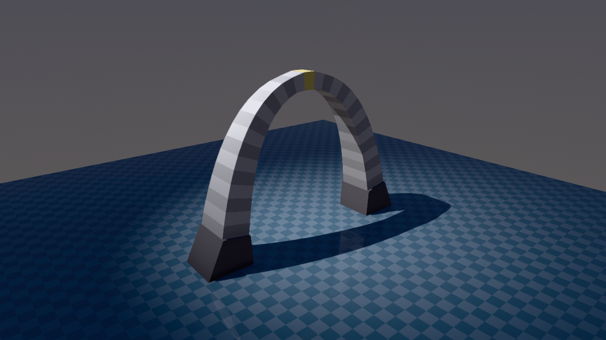
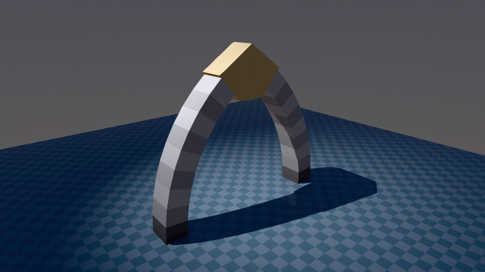

# Dry-stone arches

Three unmortared masonry arches, held up by nothing but gravity and friction. Each is a chain of
free-floating voussoirs resting on static abutments: remove the friction and they collapse, so they
are a direct test of how faithfully a solver resolves large frictional contact networks at rest.

  
  

| Model | Arch | Voussoirs | Timestep |
| --- | --- | --- | --- |
| [`roman.xml`](roman.xml) | semicircular | 27 | 0.5 ms |
| [`gothic.xml`](gothic.xml) | equilateral pointed | 19 | 2 ms (default) |
| [`hyperbolic.xml`](hyperbolic.xml) | weighted catenary | 29 | 1 ms |

The three differ in how much solver accuracy their shape demands. The gothic arch stands at the
default timestep because its pointed form keeps the thrust line near the middle of every joint. The
Roman arch, whose joints approach vertical near the springings, needs a shorter timestep to keep
integration error from accumulating into joint slip. The hyperbolic arch is a funicular: its
centerline is the weighted catenary of its own tapered self-weight, so it carries pure compression.

Two modelling choices matter more than any solver setting, and both amount to never handing the
collider a tie to break:

* **Joints are small-face-on-large-face.** The voussoirs taper in depth along the arch, so each
  joint has a clear owner rather than two coincident faces of equal size.
* **Lower faces are inset radially.** Without the inset, the intrados and extrados edges meet
  edge-on-edge in the rocking plane and pump a sway mode; with it, ringing energy drops by more
  than an order of magnitude.

Frictional stacking of this kind requires `cone="elliptic"` and a large `impratio`; the arches use
10–100. See the comments in each file for the specific recipe.

## Changelog

* 05-08-2026: Initial release.
